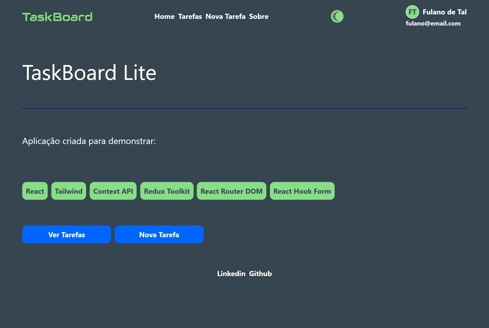
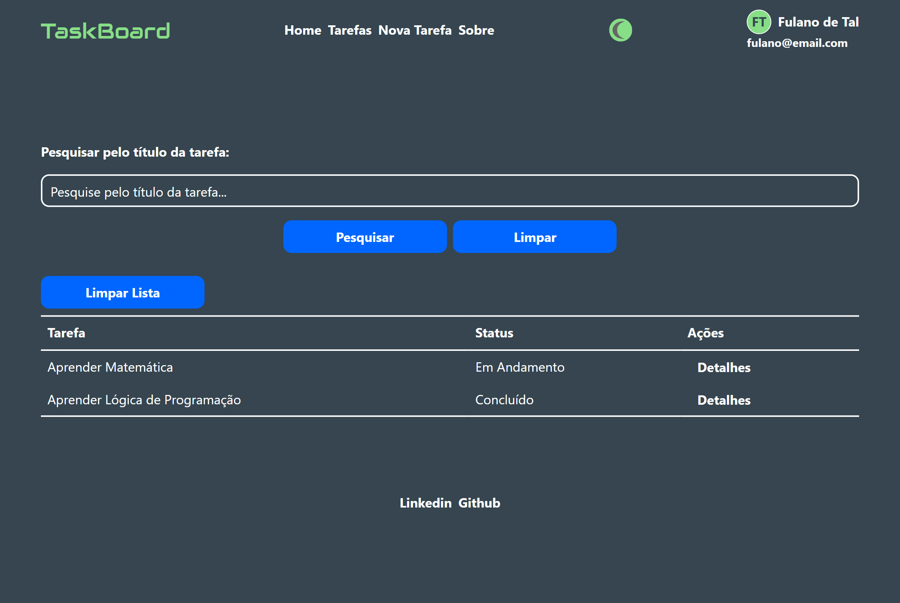
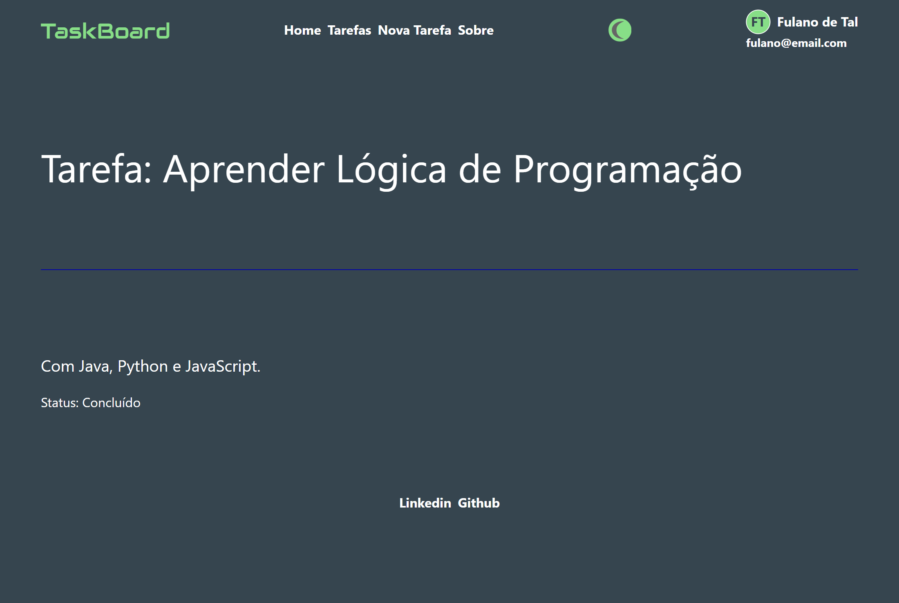
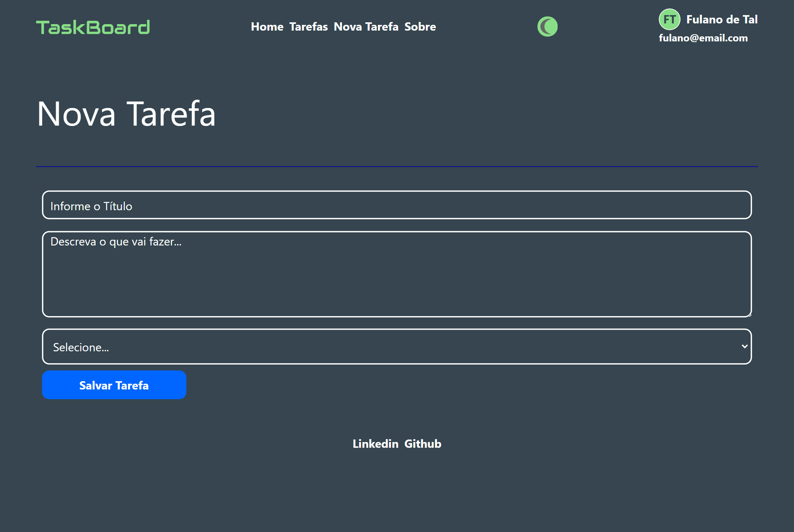
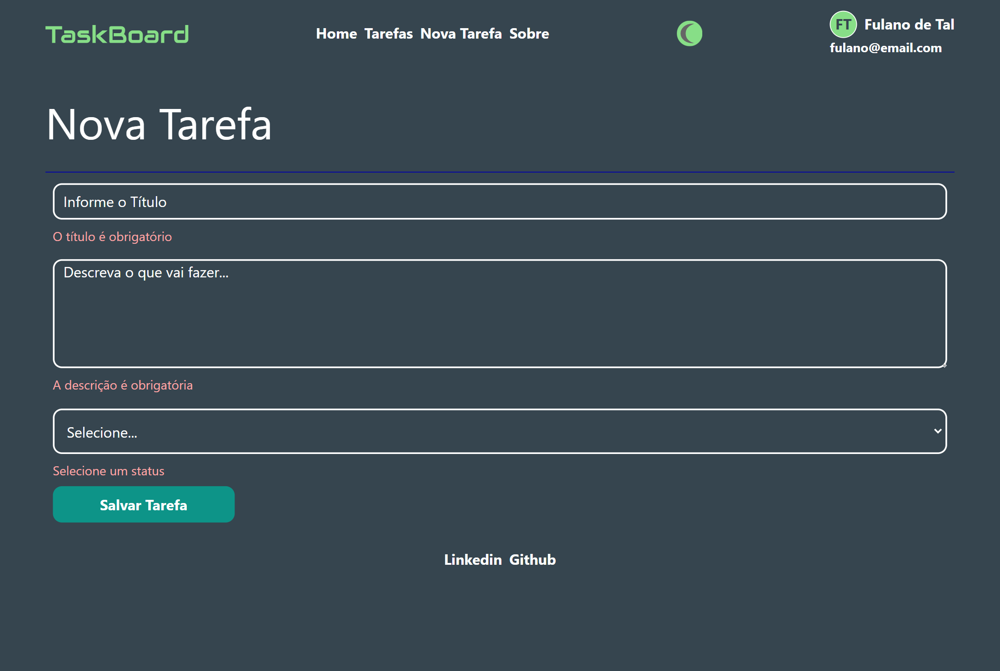
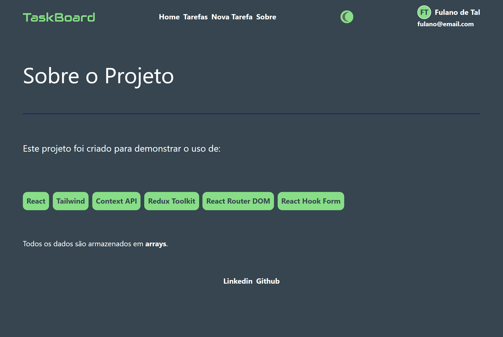
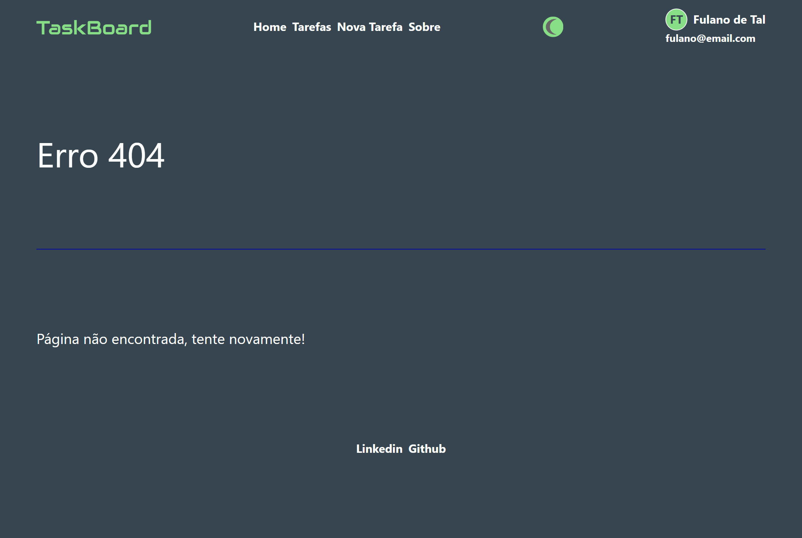
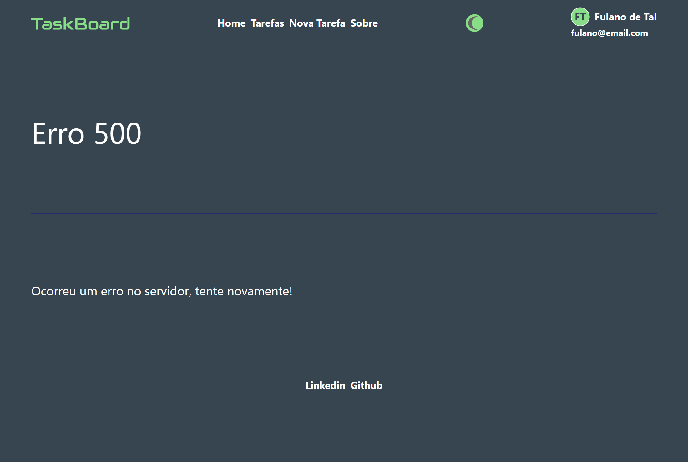

# TaskBoard Lite

### React + TypeScript + Vite

## Objetivo

Esta aplicação demonstra o uso das principais tecnologias do ecossistema React em um projeto simples e organizado. Ela utiliza React Router para navegação, Context API para configurações globais e Redux Toolkit para gerenciar uma lista de tarefas em memória. Todos os dados são armazenados em arrays, sem banco de dados ou Local Storage, com foco em boas práticas e organização de código para portfólio.

### Acesse o projeto: [TaskBoard Lite](https://albuquerque-katarine.github.io/react-vite-taskboard-lite/)

## Funcionalidades

### React Router

/<br/>
/tasks<br/>
/new<br/>
/details/:id<br/>
/about<br/>

### Context API

ThemeContext (light/dark)
UserContext (letra/name/email)

### Redux

Adiciona: dispatch(add(task))
limpar lista: dispatch(remove())

### Type

``` 
type Task = { 
  id:number; 
  title:string;
  description:string;
  status:string;
} 
```

### Home Page



### Tarefas Page



### Detalhes da Tarefa Page



### Nova Tarefa Page



### Nova Tarefa Page com Validação



### Sobre Page



### Erro 404 Page



### Erro 500 Page



## Tecnologias

- React
- TypeScript
- React Router DOM
- Tailwind CSS
- Context API
- Redux Toolkit
- React Hook Form

## Contatos
- E-mail: [kba.2879@gmail.com](mailTo:kba.2879@gmail.com)
- Linkedin: [/katarine-albuquerque](https://www.linkedin.com/in/katarine-albuquerque/)
